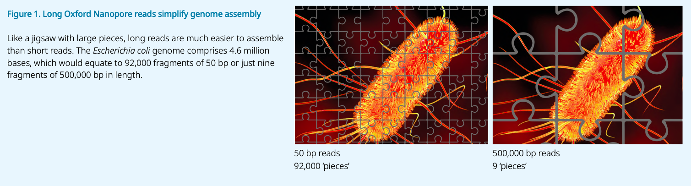
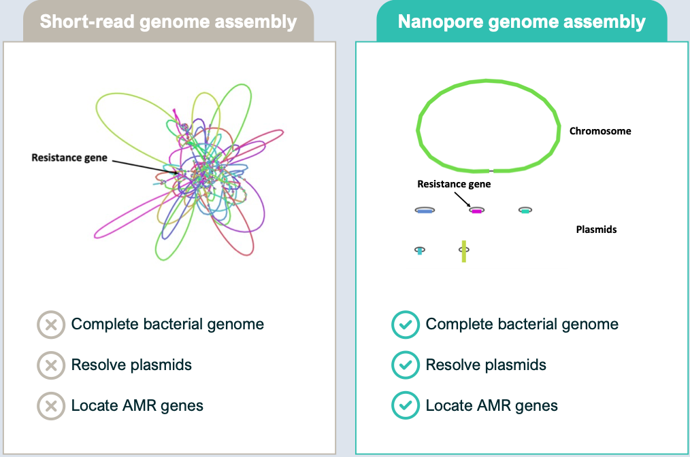
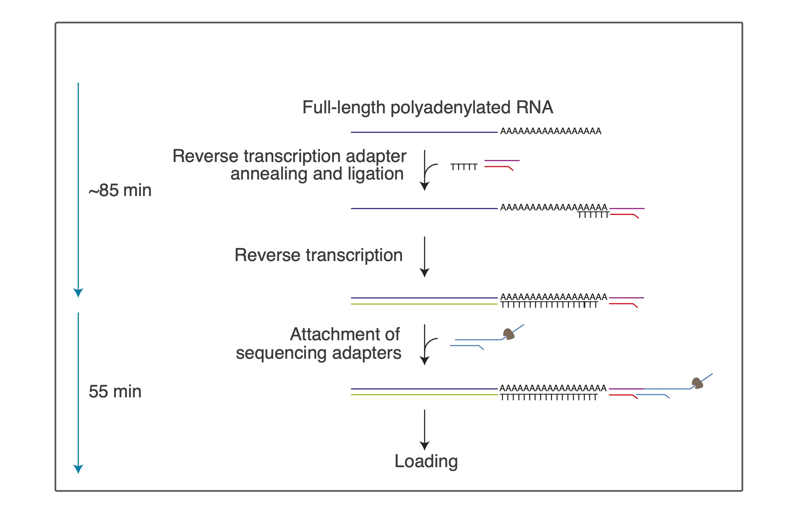
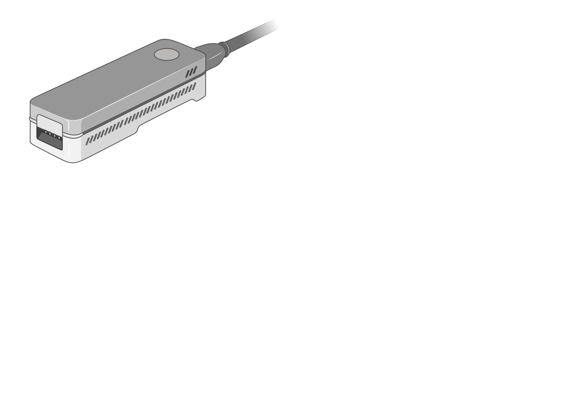
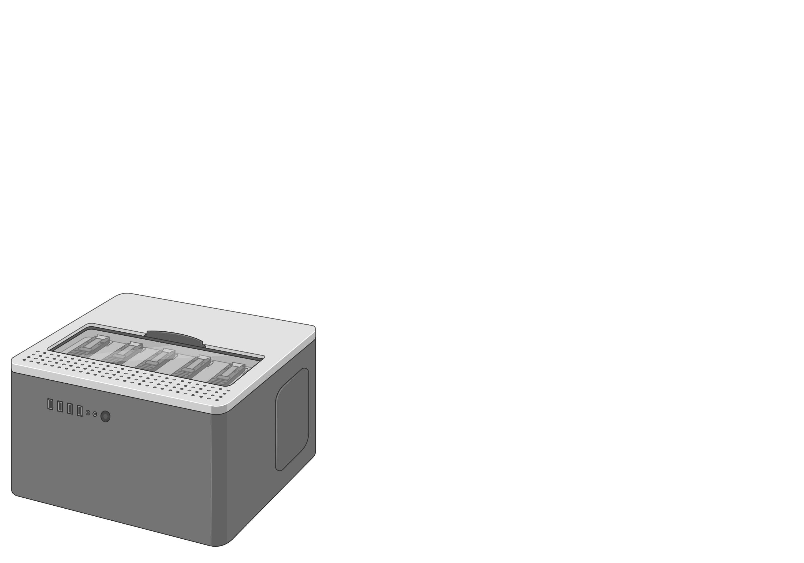
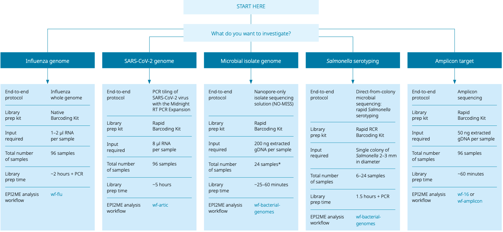
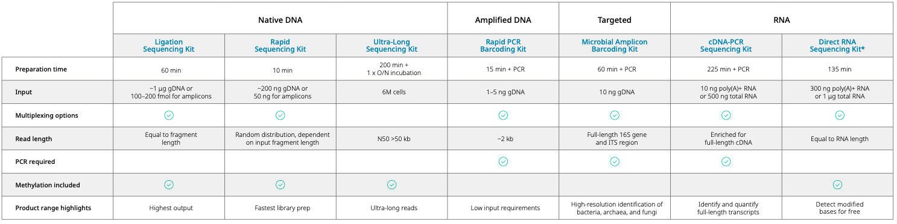
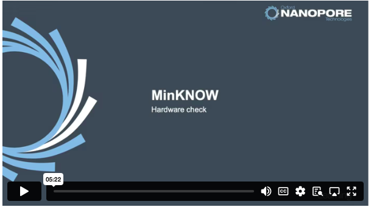
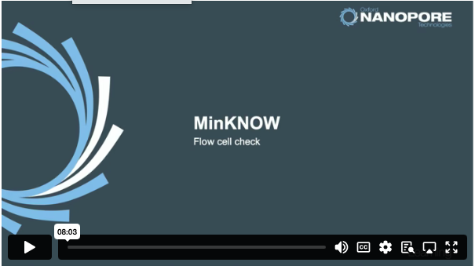
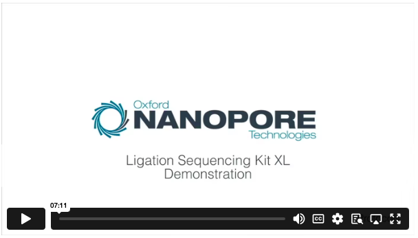

# Introduction to ONT

An introduction to ONT sequencing including applications, sample workflows, educational videos, and relevant terminology.

## 1. Overview
### What is ONT sequencing?

Oxford Nanopore Technology (ONT) is a sequencing platform which generates longer reads of genetic material compared to short read technologies such as Illumina. Genetic material is passed through nanopores embedded in a charged membrane with hundreds of pores. As genetic material passes through the pores one base pair at a time, the electric field is disrupted, and this disruption is translated to a base call.

<iframe width="560" height="315" src="https://www.youtube.com/embed/RcP85JHLmnI?si=hRO8Fb1LcmPriBa8&amp;start=5" title="YouTube video player" frameborder="0" allow="accelerometer; autoplay; clipboard-write; encrypted-media; gyroscope; picture-in-picture; web-share" referrerpolicy="strict-origin-when-cross-origin" allowfullscreen></iframe>

### How does ONT differ from other sequencing platforms?

ONT can produce extremely long reads with the capacity to sequence an entire genome in one read. In contrast to Illumina platforms which sequence by synthesis, ONT can sequence reads of unlimited length assuming they are not fragmented and have efficient adapter attachment [^differ] [^picture].

  

### What are its strengths and weaknesses?

#### Strengths
* **Resolving complex structures**
    

       
    

    * One strength of ONT is its ability to resolve short repetitive repeats which are commonly found on mobile genetic elements. ONT can also be used to resolve larger genomic structures allowing for complete assembly of both chromosome and plasmids from whole genome sequencing (WGS) data[^plasmid].

* **Direct RNA sequencing**
    

       
    

    * ONT allows for direct RNA sequencing, eliminating the biases of polymerase chain reactions (PCR) and reverse transcriptases and allowing sequencing of native RNA features[^RNA].

* **Direct sequencing of methylated areas**
    

      <iframe 
        src="https://www.youtube.com/embed/7PraIiiN_Gc?si=dKBzXDJz5rzgvaMr"
        width="560"
        height="315"
        style="border: none; display: block;">
      </iframe>
    

    * Updated super accurate basecalling algorithms allow for sequencing of heavily methylated areas which have historically caused problems for other sequencers [^methylation].

#### Weaknesses
* **Bar code bleed through**
    * Occasionally ONT will sequence reads with unused or previously used barcodes. For this reason it is best to not re-use barcodes on the same flow cell. 

* **High computational resources**

    * ONT sequencing generates large amounts of data which can be difficult to store, and basecalling algorithms work best when adequate computational resources are available. 

* **Base call accuracy**

    * One weakness of ONT technology is its basecalling is slightly less accurate than Illumina sequencing platforms. However, this gap is closing as ONT continues to release updated basecalling software [^accuracy].

---
## 2. Platform options and comparison

ONT offers several sequencer options which will be introduced below. Selection of the appropriate sequencer depends on the desired **output**, **throughput**, and **financial investment**. The full price list as of April 2026 can be found [here](https://store.nanoporetech.com/us/priceList.html). All sequencers come with a year of standard support, but this is not needed to continue downloading software and hardware updates especially for the basecaller.

### MinION

    

The MinION is the smallest sequencing platform, holds a singular flow cell, and can output between 15-35Gb of data [^library]. The cost for a start up pack which includes the sequencer, five flow cells, controls, library preparation kit, a flow cell wash kit, and standard one year support is $5,150 [^biorender].

### GridION

  

The GridION holds one to five MinION flow cells, and each flow cell can output 15-35Gb of data [^library]. The price is available upon request and includes one year of standard support. Options are available for extending the standard support or purchasing more extensive support [^biorender]. 

### PromethION

  

The PromethionION holds one to 24 PromethION flow cells depending on the sequencer model, but each flow cell can output 100-200Gb of data [^library]. The price is available upon request and includes one year of standard support. Options are available for extending the standard support or purchasing more extensive support [^biorender].

### ElysION

The ElysION holds one to 24 PromethION flow cells depending on the sequencer model, but each flow cell can output 100-200Gb of data [^library]. The price is available upon request and includes one year of standard support. Options are available for extending the standard support or purchasing more extensive support.

---

## 3. Applications

### **Pathogen discovery**

### **Influenza sequencing**

### **Detection of anti-microbial resistance**

---

## 4. Library Prep Kit Comparison

ONT provides example workflows for end-to-end sequencing applications as well as guidance for library preparation of unknown and known bacterial or viral pathogens[^library].

    

ONT also provides a comparison of library preparation kits based on input material, time considerations, required input concentrations of genetic material, desired read length, and a PCR requirement[^library].

    

---

## 5. How-to Videos

### Hardware check (MinION)

  

A hardware check should be conducted before a sequencing run to ensure the software is up-to-date. Click on the image to watch the video of a hardware check performed in MinKnow on the Mk1B device. The process is comparable between ONT sequencers.

### Flow cell check (MinION)

  

A flow cell check should be conducted before a sequencing run to ensure the flow cell has enough pores for sequencing. Click on this image to watch a flow cell check performed in MinKnow on the Mk1B device. The process is comparable between ONT sequencers.

### Library preparation

  

Click on the image to see a video demonstration of library preparation using the Ligation Sequencing Kit XL.

### Flow cell loading

  <iframe 
    src="https://www.youtube.com/embed/Pt-iaemrM88?si=TOKWnZjGIHXiXINX"
    width="560"
    height="315"
    style="border: none; display: block;">
  </iframe>

This is a video demonstration of flow cell priming and loading which are done immediately prior to loading a prepared library onto the sequencer.

### Flow cell cleaning

  

This is a protocol for washing and re-using or storing ONT flow cells. Click on the image and navigate to the *prepare for your flow cell wash section* of this protocol to watch a flow cell wash immediately followed by the loading of a subsequent library preparation.

---

## 6. Example SOPs

ONT’s resource page offers a variety of example workflows and protocols. This [protocol](https://nanoporetech.com/document/rapid-sequencing-gdna-barcoding-sqk-rbk114) for example details library preparation with the Rapid Barcoding Kit (SQK-RBK114.24 for 24 samples). It includes an overview of the protocol, additional equipment needed, troubleshooting tips, as well as videos of key steps. Similar [protocols](https://nanoporetech.com/documentation/results?category=application-workflows) are available for other library preparation kits and applications.

Protocols developed by NAHLN members

* DNA extraction
* RNA extraction
* Rapid barcoding kit library preparation
* Ligation 

---

## 7. Glossary of ONT Terms

This [website](https://nanopore4edu.org/other_resources/glossary/) provides definitions of common terms associated with ONT sequencing.

---

## Sources
[^differ]: Jain, M., Koren, S., Miga, K. et al. Nanopore sequencing and assembly of a human genome with ultra-long reads. Nat Biotechnol 36, 338–345 (2018). https://doi.org/10.1038/nbt.4060.
[^picture]: https://a.storyblok.com/f/196663/x/d45b77be8d/microbial-sequencing-guide.pdf
[^plasmid]: Dr. Kimberlee Musser, Wadsworth Center, NYSDOH, ‘Improving bacterial disease public health testing with nanopore sequencing’ presented at NCM 2023
[^accuracy]: Schiffer AM, Rahman A, Sutton W, Putnam ML,Weisberg AJ.2025.A comparison of short- and long-read whole-genome sequencing for microbial pathogen epidemiology. mSystems10:e01426-25.https://doi.org/10.1128/msystems.01426-25.
[^RNA]: https://nanoporetech.com/document/direct-rna-sequencing-sqk-rna004 
[^methylation]: Galeone, V., Dabernig-Heinz, J., Lohde, M. et al. Decoding bacterial methylomes in four public health-relevant microbial species: nanopore sequencing enables reproducible analysis of DNA modifications. BMC Genomics 26, 394 (2025). https://doi.org/10.1186/s12864-025-11592-z 
[^biorender]: Created in BioRender. Gregory, D. (2026) https://BioRender.com/a9vgxxa
[^library]: https://a.storyblok.com/f/196663/x/8e638eb0b9/brochure-product.PDF