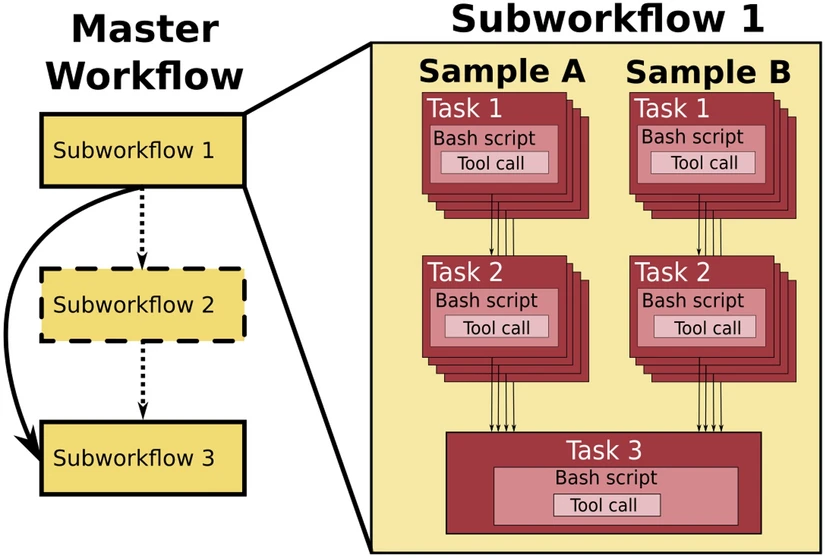

# Introduction to bioinformatics

An introduction to analyzing NGS data with bioinformatics including programs, workflows, educational videos, and relevant terminology.

## 1. Overview
### What is bioinformatics?

Bioinformatics is an interdisciplinary field that combines computer science and statistics to analyze and interpret biological datasets. Genomics is a specific branch of bioinformatics that focuses on analyzing DNA sequencing data to glean biologically relevant insights

### How to do bioinformatic analyses? 

---

## 3. Comparison of platforms for bioninformatic analyses

### Graphical user interface (GUI)

* **Strengths**

* **Weaknesses**

* **Examples**

### Web-based tools

* **Strengths**

* **Weaknesses**

* **Examples**

### Command line interface (CLI)

* **Strengths**

* **Weaknesses**

* **Examples**

---

## 4. Glossary of bioinformatics terms

---

## 5. Commonly used software packages

### Read quality control (QC)

### Read trimming

### Assembly

### Annotation

### Genes of interest

### Phylogenetics

### Variant calling

---

## 6. Overview of Globus

---

## 7. Overview of workflow managers

       
    

A workflow manager runs each process and subprocess of a bioinformatic workflow once the previous ones have finished. Using a workflow manager increases reproducibility and saves time [^workflow]. 

### Snakemake
* **Strengths**

* **Weaknesses**

### Nextflow
* **Strengths**

* **Weaknesses**

---

## Sources

[^workflow]: Ahmed, A.E., Allen, J.M., Bhat, T. et al. Design considerations for workflow management systems use in production genomics research and the clinic. Sci Rep 11, 21680 (2021). https://doi.org/10.1038/s41598-021-99288-8
## **Consultation request form**

NAHLN members are happy to provide input on bioinformatic applications. Please fill out this form. 
